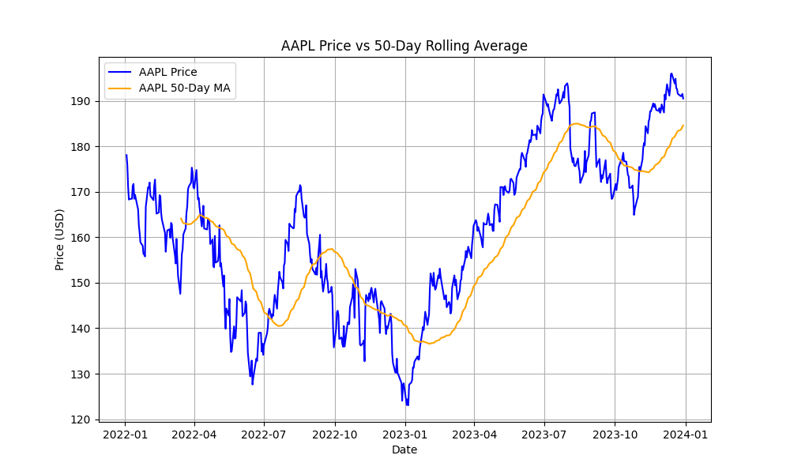
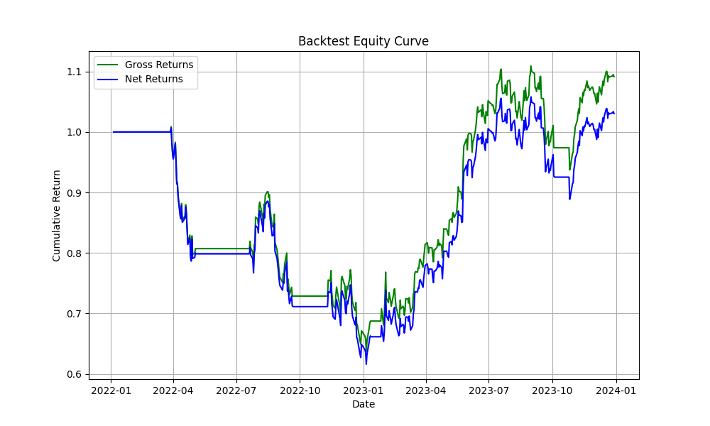
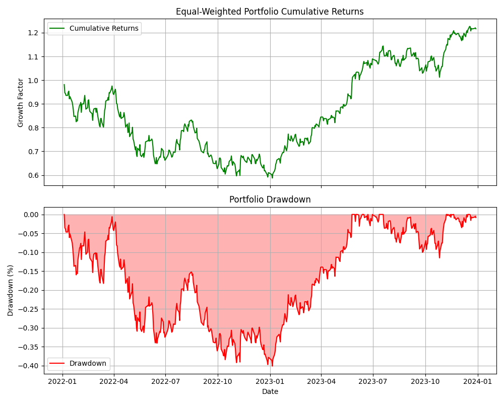

# Mini Quantitative Research Project


> Mini Quantitative Research Pipeline for Developing and Backtesting Systematic Trading Strategies in Python

## Table of Contents

- [Overview](#overview)
- [Objectives](#objectives)
- [Project Structure](#project-structure)
- [Data Sources](#data-sources)
- [Implemented Modules](#implemented-modules)
- [Example Results](#example-results)
- [Usage](#usage)
- [Technologies](#technologies-used)
- [Future Improvements](#future-improvements)
- [License](#license)

## Overview

This repository contains a mini quantitative research pipeline for developing, testing, and analyzing systematic trading strategies using Python.

The project replicates key components of a typical workflow used by quantitative researchers in hedge funds and proprietary trading firms, including:

- Financial data collection
- Signal generation
- Strategy backtesting
- Portfolio construction
- Risk analysis
- Performance visualization

The system uses historical equity data to simulate algorithmic trading strategies and evaluate their performance using standard financial metrics.

## Key Features

- Modular research pipeline for systematic trading experiments
- Historical market data ingestion via yfinance
- Moving-average trend-following strategy
- Factor-based portfolio allocation
- Strategy backtesting with performance metrics
- Risk analysis including maximum drawdown
- Sentiment-driven trading prototype using transformer models
- Visualization of price data, signals, and portfolio performance

## Objectives

The main goals of this project are:

- Understand the workflow of quantitative trading research
- Implement simple systematic trading strategies
- Build a modular backtesting framework
- Analyze risk and performance of strategies
- Explore factor-based portfolio construction

This project serves as a learning foundation for quantitative finance, algorithmic trading, and financial data analysis.

## Project Structure

```text
quant_mini_project/
├── data/                  # stock prices, news headlines
├── plots/                 # generated charts
├── scripts/               # Python scripts for each project
├── notebooks/             # Probability puzzles
├── README.md
└── requirements.txt
```

## Data Sources

The project uses data from **Yahoo Finance** via the `yfinance` Python library.

Assets used in experiments include:
- Apple Inc. (AAPL)
- Microsoft Corporation (MSFT)
- Amazon.com Inc. (AMZN)
- NVIDIA Corporation (NVDA)

## Implemented Modules

### 1. Moving Average Strategy

Implements a basic trend-following strategy using rolling averages.

**Features:**
- price vs moving average signals
- long/flat trading logic
- visualization of price and indicators

**Script:** `scripts/rolling_average.py`  
**Output:** `plots/price_vs_ma.png`

### 2. Strategy Backtesting Engine

A lightweight backtesting engine that simulates trading performance over historical data.

**Key metrics:**
- cumulative return
- Sharpe ratio
- equity curve

**Script:** `scripts/backtester.py`  
**Output:** `plots/backtest_equity_curve.png`

### 3. Factor Portfolio Engine

Implements a simple factor-based portfolio strategy, allocating capital across assets based on signals. 

This module explores the idea behind factor investing, commonly used in quantitative asset management.

**Script:** `scripts/factor_engine.py`  
**Output:** `plots/factor_portfolio.png`

### 4. Risk Metrics Analysis

Calculates important portfolio risk statistics including:
- cumulative returns
- maximum drawdown
- portfolio risk profile

**Script:** `scripts/risk_metrics.py`  
**Output:** `plots/cumulative_vs_drawdown.png`

### 5. AI Sentiment Trading Prototype

A prototype experiment combining news sentiment analysis with trading signals. 

The script uses a transformer-based sentiment model from Hugging Face to score financial headlines and simulate a sentiment-driven trading strategy.

**Script:** `scripts/ai_sentiment_trading.py`  
**Output:** `plots/sentiment_strategy.png`

## Strategy Visualization

### Moving Average Strategy


### Backtest Equity Curve


### Portfolio Drawdown


## Example Results

Example output from the backtest:

- **Sharpe Ratio (Net):** 0.19
- **Maximum Drawdown:** -40%

These results illustrate that simple strategies often produce modest performance and can experience significant drawdowns, highlighting the importance of risk management and strategy refinement in quantitative trading systems.

## Installation

Clone the repository:

```bash
git clone https://github.com/markopom/quant_mini_project.git
cd quant_mini_project
```

Install dependencies:

```bash
pip install -r requirements.txt
```

## Usage

```bash
# Run strategy modules
python scripts/rolling_average.py
python scripts/factor_engine.py

# Run probability puzzles notebook
jupyter notebook notebooks/probability_puzzles.ipynb
```

## Technologies Used

- Python
- pandas
- numpy
- matplotlib
- yfinance
- transformers
- machine learning models for sentiment analysis

## Future Improvements

Several extensions could further improve the realism and robustness of the research pipeline:

### Transaction Cost Modeling
Current backtests assume frictionless trading. Future versions will incorporate:

- transaction costs
- bid-ask spread simulation
- slippage modeling

This will allow a more realistic evaluation of trading strategies.

### Walk-Forward Validation
To reduce overfitting risk, the research pipeline could be extended with walk-forward testing:

- train strategy on historical period
- evaluate on unseen out-of-sample data

### Benchmark Comparison
Strategy performance can be compared against benchmark portfolios such as:

- buy-and-hold strategy
- equal-weighted portfolio
- market index benchmarks

This would provide clearer evaluation of strategy performance relative to the market.

### Advanced Research Extensions
Additional research directions include:

- multi-factor portfolio models
- volatility targeting
- reinforcement learning trading strategies
- high-frequency market microstructure analysis
- sentiment analysis using real financial news datasets

## Educational Purpose

This project was built as a learning exercise in quantitative finance and algorithmic trading. It demonstrates how financial data can be transformed into trading signals and evaluated through systematic backtesting.

## License

This project is released under the MIT License.
